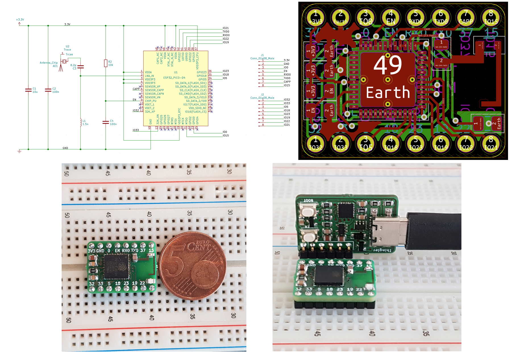

# Thingler ESP32-PICO-D4 Module

Thingler ESP32-PICO-D4 Module is a small size ESP32 development board with a minimum of required external components (including antenna). It's in the size of 20.60 mm x 15.60 mm with 16 pins and can be placed on a breadboard for prototyping. The module can be powered and programmed with the [Thingler ESP32 Programmer](https://github.com/thingler/esp32-programmer) but can also be powered with a separate power supply for small-sized designs.

Thingler ESP32 Programmer schematics and PCB has been designed with KiCad.

## Getting started

### Requirements

* [KiCad](https://kicad-pcb.org/download/) for the schematics

* [Thingler ESP32 Programmer](https://github.com/thingler/esp32-programmer)

### Pin configuration

Due to the size of the module, only part of the pins from the ESP32 microcontroller is exposed. Many of the ESP32 features can be configured to any of the I/O pins but some considerations has been made during the design of the module. Sice the ADC2 is shared with the WIFI module, which has higher priority, reading operation of adc2_get_raw() will fail between esp_wifi_start() and esp_wifi_stop(). Hence, three ADC1 channels have been exposed from the module in order to read ADC conversions during WIFI operation. Pins for one SPI peripheral has also been exposed from the module.

Thingler ESP32-PICO-D4 Module has the following pin configuration:

| Name | Micro controller pin | Type | Function |
| --- | --- | --- | --- |
| 3V3 | 1, 3, 4, 19, 37, 43, 46 | P | Analog power supply (2.3V ~ 3.gV) |
| GND | 49 | P | Analog power supply (ground) |
| IO0 | 23 | I/O | ADC2_CH1, TOUCH1, RTC_GPIO11, CLK_OUT1, EMAC_TX_CLK |
| EN | 9 | I | High: On; enables the module, Low: Off; resets the module |
| RXD0 | 40 | I/O | GPIO3, U0RXD, CLK_OUT2 |
| TXD0 | 41 | I/O | GPIO1, U0TXD, CLK_OUT3, EMAC_RXD2 |
| IO37 | 6 | I | GPIO37, ADC1_CH1, RTC_GPIO1 |
| IO15 | 21 | I/O | ADC2_CH3, TOUCH3, RTC_GPIO13, MTDO, HSPICS0, HS2_CMD, SD_CMD, EMAC_RXD3 |
| IO32 | 12 | I/O | 32K_XP (32.768 kHz crystal oscillator input), ADC1_CH4, TOUCH9, RTC_GPIO9 |
| IO33 | 13 | I/O | 32K_XN (32.768 kHz crystal oscillator output), ADC1_CH5, TOUCH8, RTC_GPIO8 |
| IO5 | 34 | I/O | GPIO5, VSPICS0, HS1_DATA6, EMAC_RX_CLK |
| IO18 | 35 | I/O | GPIO18, VSPICLK, HS1_DATA7 |
| IO19 | 38 | I/O | GPIO19, VSPIQ, U0CTS, EMAC_TXD0 |
| IO23 | 36 | I/O | GPIO23, VSPID, HS1_STROBE |
| IO22 | 39 | I/O | GPIO22, VSPIWP, U0RTS, EMAC_TXD1 |
| IO21 | 42 | I/O | GPIO21, VSPIHD, EMAC_TX_EN |

### Build

The PCB wihout components can be ordered from [Aisler](https://aisler.net/p/AAOREKRK) or the PCB can be ordered from any fabrication houses by providing the [gerber files](Gerbers).

The following components has been used for the module:

| Ref | Qty | Manufacturer Part Number | Manufacturer | Description | Product Link |
| --- | --- | --- | --- | --- | --- |
| U1 | 1 | ESP32-PICO-D4 | Espressif Systems | RF System on a Chip - SoC SIP module ESP32 with 4MByte Flash, Dual Core MCU, Wi-Fi & Bluetooth Combo, LGA48-pin, 7*7mm | [Mouser](https://www.mouser.fi/ProductDetail/Espressif-Systems/ESP32-PICO-D4?qs=%2Fha2pyFaduiJl06ShC5IabTDBhPqv0imJnxhI4ylo8F49tYkjz2bMxrgCTKL77hq) |
| J1, J2 | 2 | 10129378-908002BLF | Amphenol FCI | Headers & Wire Housings ECONOSTIK HEADER SR VT TH 1X8 | [Mouser](https://www.mouser.fi/ProductDetail/Amphenol-FCI/10129378-908002BLF?qs=sGAEpiMZZMs%252BGHln7q6pm8Vn94ktop%2FJRLMW1D975zRqXbv0UaHrSw%3D%3D) |
| AE1 | 1 | 2450AT14A0100T | Johanson Technology | Antennas SMALL AREA 2.4G ANT | [Mouser](https://www.mouser.fi/ProductDetail/Johanson-Technology/2450AT14A0100T?qs=sGAEpiMZZMuBTKBKvsBmlN73K%2F2BcYXlKAGDK9p9NA4JvyuVwsRwMQ%3D%3D) |
| C1 | 1 | CGA4J1X7R0J106K125AC | TDK | 10 uF 10% 0805 6.3V | [Mouser](https://www.mouser.fi/ProductDetail/TDK/CGA4J1X7R0J106K125AC?qs=sGAEpiMZZMs0AnBnWHyRQEWjzA2rN6H9xJ%252BQ6n29nI0%3D) |
| C2, C4 | 2 | 885012207098 | Wurth Elektronik | 100 nF 10% 0805 50V | [Mouser](https://www.mouser.fi/ProductDetail/Wurth-Elektronik/885012207098?qs=sGAEpiMZZMs0AnBnWHyRQEGbLOF2VP1iyH0H1Hok68ReUt26c8JOqw%3D%3D) |
| C3 | 1 | 251R15S8R2CV4E | Johanson Technology | Multilayer Ceramic Capacitors MLCC - SMD/SMT 250volts 8.2pF | [Mouser](https://www.mouser.fi/ProductDetail/Johanson-Technology/251R15S8R2CV4E?qs=sGAEpiMZZMs0AnBnWHyRQMEhg08ZZBbf6%252BTDomkmMZo%3D) |
| L1 | 1 | AIMC-0805-1N5S-T | ABRACON | Fixed Inductors 1.5nH, 600mA Tol.=+/-.3nH | [Mouser](https://www.mouser.fi/ProductDetail/ABRACON/AIMC-0805-1N5S-T?qs=sGAEpiMZZMsg%252By3WlYCkUwX6XY3JXxzLPrj0ZACc8Ao%3D) |
| R1 | 1 | CRCW080510K0FKEAC | Vishay / Dale | Thick Film Resistors - SMD 1/8Watt 10Kohms 1% Commercial Use | [Mouser](https://www.mouser.fi/ProductDetail/Vishay-Dale/CRCW080510K0FKEAC?qs=sGAEpiMZZMtlubZbdhIBIIZe04wfiaJWcT48uZO055s%3D) |

## License

Released under [GNU/GPL Version 3](LICENSE)
